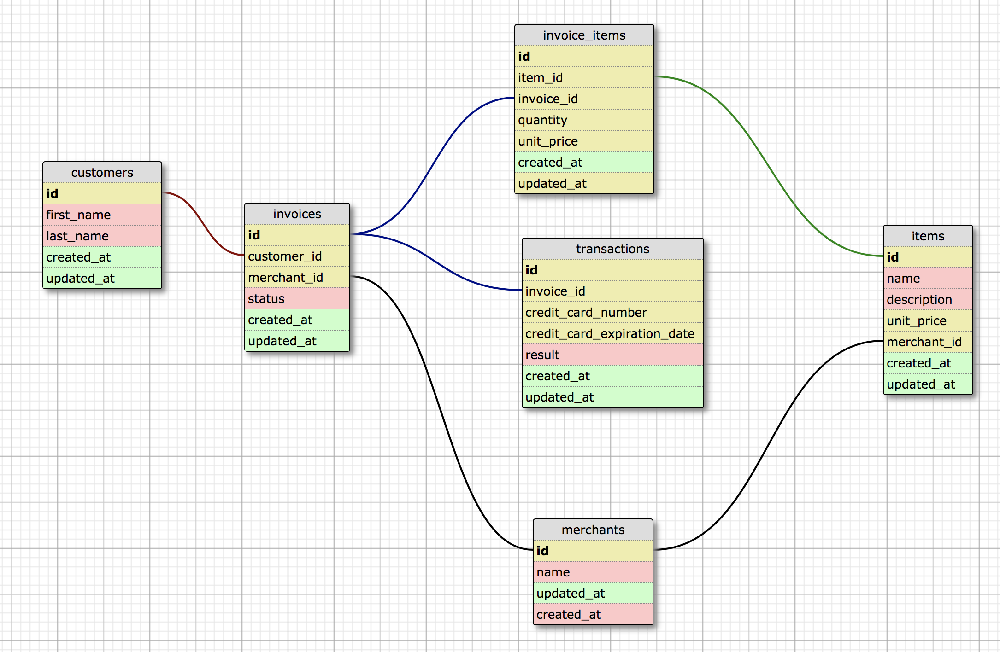

# Rails Sales Engine
## Application Overview
This application is designed to execute business analytic queries against an actual e-commerce business dataset (sanitized).  
A JSON API is built using Rails and ActiveRecord which exposes the relationships within the database and peforms complex analytic queries.  This is a collaborative project between Joseph Jobes and Andrew Jeffery while attending the Back End Engineering Program at the Turing School of Software & Design.  

## Interacting with the API
### Resources to be displayed:
* Merchants
* Customers
* Invoices
* Items
* Invoice Items
* Transactions

## Database Design / Schema


## Setup
To run the rails engine on your local machine, please use the following setup steps:

* Clone down the repo onto your local machine
```
$ git clone https://github.com/amj133/rails-engine.git
```
* Navigate to the rails-engine directory and bundle to add all necessary gems
```
$ bundle install
```
* Then to setup and load the database run the following commands
```
$ rails db:create
$ rails db:migrate
$ rake load_sales_data:all
```
* If you wish to import specific data please run any of these commands for the specific type you would like
```
$ rake load_sales_date:load_all_merchants       # for all merchants
$ rake load_sales_date:load_all_customers       # for all customers
$ rake load_sales_date:load_all_invoices        # for all invoices
$ rake load_sales_date:load_all_items           # for all items
$ rake load_sales_date:load_all_invoice_items   # for all invoice items
$ rake load_sales_date:load_all_transactions    # for all transactions
```

## Testing 
* Rails Engine has a fully fleshed out rspec test suite. If you would like to run the tests please execute this command in the terminal.
```
$ rspec
```
* If you are running an older version of rspec then run
```
$ bundle exec rspec
```
